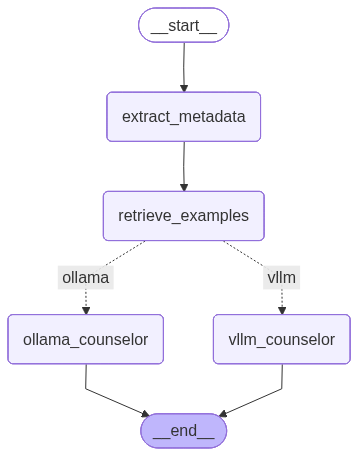

# civil-complaint-chatbot
민원상담-챗봇-프로젝트

> **팀명**: 상담랜드
> **프로젝트**: 멀티턴 대화 맥락을 유지하는 고객 상담 챗봇
> **기간**: 2025년 10월

---

## 📋 목차

1. [프로젝트 개요](#-프로젝트-개요)
2. [주요 기능](#-주요-기능)
3. [시스템 아키텍처](#-시스템-아키텍처)
4. [파일 구조](#-파일-구조)
5. [데이터 구조](#-데이터-구조)
6. [모듈별 상세 설명](#-모듈별-상세-설명)
7. [설치 및 실행](#-설치-및-실행)
8. [사용 방법](#-사용-방법)

---

## 🎯 프로젝트 개요

### 목표
고객과의 **멀티턴 대화 맥락을 유지**하며 자연스럽게 응답하는 상담 챗봇 구축

### 핵심 기능
- ✅ **멀티턴 대화 지원**: 최근 8턴 맥락 유지 (슬라이딩 윈도우)
- ✅ **도메인 자동 분류**: 금융/통신/여행 도메인 자동 인식
- ✅ **동적 Few-shot Learning**: 대화 길이에 따라 예시 개수 조정 (1-2개)
- ✅ **메타데이터 기반 검색**: 도메인 필터링으로 정확한 예시 검색
- ✅ **하이브리드 Vector DB**: Pinecone/ChromaDB 자동 선택
- ✅ **환경별 자동 라우팅**: GPU/Mac 환경 자동 감지 및 최적화
- ✅ **KV/Prefix Cache**: 멀티턴 대화 최적화 (Ollama/vLLM)
- ✅ **세션 관리**: 대화별 독립적인 세션 저장
- ✅ **실시간 응답**: Streamlit 기반 대화형 UI

### 기술 스택
- **Framework**: LangGraph 1.0.2 (워크플로우), Streamlit (UI)
- **LLM**:
  - **파인튜닝 모델**: Llama 3.1 8B + LoRA (상담 데이터 기반)
  - **메타데이터 추출**: OpenAI GPT-4o-mini
- **추론 엔진**:
  - **GPU**: vLLM (Prefix Caching)
  - **Mac/CPU**: Ollama (KV Cache)
- **Vector DB**: Pinecone (클라우드) 또는 ChromaDB (로컬) - 자동 선택
- **데이터**: 상담 대화 데이터 (7,997건)

---

## ✨ 주요 기능

### 1. 도메인 자동 분류
사용자 질문과 대화 맥락을 분석하여 자동으로 도메인 결정
```
"카드 분실했어요" → 금융
"요금제 변경하고 싶어요" → 통신
"호텔 예약 가능한가요?" → 여행
```

### 2. 멀티턴 대화 맥락 유지
슬라이딩 윈도우 방식으로 최근 8턴의 대화를 기억
```
고객: 카드 분실했어요
상담사: 언제 분실하셨나요?
고객: 어제요  ← 맥락 이해!
상담사: 어제 분실하신 카드 재발급 도와드리겠습니다.
```

### 3. 동적 Few-shot 예시 활용
대화 길이에 따라 예시 개수 자동 조정
```
대화 20턴 이하 → Few-shot 예시 2개 활용
대화 20턴 초과 → Few-shot 예시 1개 활용 (토큰 절약)
```

### 4. 도메인 기반 예시 검색
도메인 필터링으로 관련성 높은 예시만 검색
```
[금융 도메인 질문]
→ 금융 관련 예시만 검색 (카드, 결제, 포인트 등)

[통신 도메인 질문]
→ 통신 관련 예시만 검색 (요금제, 데이터 등)
```

### 5. 하이브리드 Vector Database
Pinecone API 키 유무에 따라 자동으로 최적의 Vector DB 선택
```
PINECONE_API_KEY 있음 → Pinecone 사용 (클라우드, 고성능)
PINECONE_API_KEY 없음 → ChromaDB 사용 (로컬, 간편)
```

### 6. 환경별 자동 라우팅 🆕
실행 환경을 자동 감지하여 최적의 추론 엔진 선택
```
GPU 환경 감지 → vLLM (Prefix Caching)
Mac/CPU 환경 감지 → Ollama (KV Cache)
```

**최적화 기술**:
- **vLLM Prefix Caching**: 반복되는 프롬프트 캐싱으로 멀티턴 속도 향상
- **Ollama KV Cache**: Key-Value Cache로 이전 대화 컨텍스트 재사용

---

## 🏗️ 시스템 아키텍처

### 전체 파이프라인



```
┌─────────────────────────────────────────────────────────┐
│                    사용자 입력                            │
└─────────────────────────────────────────────────────────┘
                          ↓
┌─────────────────────────────────────────────────────────┐
│            Metadata Extractor                           │
│  - 도메인 분류 (금융/통신/여행/기타)                       │
│  - 대화 턴 수 계산                                       │
│  - 최근 4턴 맥락 고려                                     │
└─────────────────────────────────────────────────────────┘
                          ↓
┌─────────────────────────────────────────────────────────┐
│              Vector Store                               │
│  - Pinecone 또는 ChromaDB (자동 선택)                    │
│  - 도메인 필터링 검색                                     │
│  - 대화 길이별 예시 개수 조정                             │
│    · ≤20턴: 2개 예시                                    │
│    · >20턴: 1개 예시                                    │
└─────────────────────────────────────────────────────────┘
                          ↓
          ┌───────────────────────────────┐
          │  Environment Router (자동 감지) │
          └───────────────────────────────┘
                 ↙                   ↘
       [GPU 환경]                [Mac/CPU 환경]
           ↓                           ↓
┌──────────────────────┐   ┌──────────────────────┐
│   vLLM Counselor     │   │  Ollama Counselor    │
│  - Llama 3.1 8B      │   │  - Llama 3.1 8B      │
│  - LoRA 파인튜닝      │   │  - LoRA 파인튜닝      │
│  - Prefix Caching    │   │  - KV Cache          │
└──────────────────────┘   └──────────────────────┘
           ↓                           ↓
┌─────────────────────────────────────────────────────────┐
│                    최종 답변 생성                          │
└─────────────────────────────────────────────────────────┘
```

### Vector Database 선택 로직
```
환경 변수 확인
    ↓
PINECONE_API_KEY 있음?
    ├─ YES → Pinecone 사용
    │        ├─ 성공 → Pinecone으로 운영
    │        └─ 실패 → ChromaDB로 자동 전환
    └─ NO  → ChromaDB 사용
```

### 환경별 추론 엔진 선택 로직 🆕
```
시스템 환경 감지
    ↓
GPU (CUDA) 사용 가능?
    ├─ YES → vLLM 설치 확인
    │        ├─ 설치됨 → vLLM (Prefix Caching)
    │        └─ 미설치 → Ollama (KV Cache)
    └─ NO  → Mac/CPU 감지 → Ollama (KV Cache)
```

### 세션 관리
```python
SessionStore (메모리 기반)
├── session_id_1
│   ├── conversation_history: [...]
│   ├── created_at: "2025-10-27T10:00:00"
│   └── last_updated: "2025-10-27T10:15:00"
├── session_id_2
│   └── ...
```

---

## 📁 파일 구조

```
project/
├── main.py                          # Streamlit UI 메인 앱
├── graph.py                         # LangGraph 구조 + 상태 정의 + 세션 관리
├── visualize_graph.py               # 그래프 구조 시각화 도구
├── merge_lora_adapter.py            # LoRA 어댑터 병합 스크립트
├── Modelfile                        # Ollama 모델 설정 파일
│
├── models/                          # 노드 모듈
│   ├── __init__.py                 # 패키지 초기화
│   ├── metadata_extractor.py       # 메타데이터 추출 노드 (도메인 분류)
│   ├── vector_store.py             # Vector DB 검색 노드 (Pinecone/ChromaDB)
│   ├── env_detector.py             # 환경 감지 (GPU/Mac/CPU) 🆕
│   ├── vllm_wrapper.py             # vLLM 추론 래퍼 (Prefix Cache) 🆕
│   ├── ollama_wrapper.py           # Ollama 추론 래퍼 (KV Cache) 🆕
│   └── unified_counselor.py        # 통합 상담 모델 (프롬프트 빌더)
│
├── Finetuning_Models/               # 파인튜닝 모델 디렉토리 🆕
│   ├── llama_3.1/                  # LoRA 어댑터 (원본)
│   └── llama_3.1_merged/           # 병합된 모델 (15.3GB)
│
├── data/                            # 데이터
│   ├── outputs/
│   │   └── see_out_see_out.csv     # Q&A 데이터
│   └── raw_data_messages_normalized_seg_turn3.jsonl  # 원본 상담 대화 🆕
│
├── chroma_db/                       # ChromaDB 저장소 (자동 생성)
├── graph_diagram.png                # 그래프 시각화 이미지 🆕
├── graph_diagram.md                 # Mermaid 다이어그램 🆕
│
├── .env                             # 환경 변수 (API 키)
├── .gitignore                       # Git 제외 파일
├── requirements.txt                 # 의존성 패키지 (기본)
├── requirements-base.txt            # 공통 의존성
├── requirements-gpu.txt             # GPU 환경 의존성 🆕
├── requirements-mac.txt             # Mac 환경 의존성 🆕
└── README.md                        # 프로젝트 문서
```

---

## 📊 데이터 구조

### 1. see_out_see_out.csv (Q&A 데이터)
Few-shot 예시로 사용되는 질문-답변 쌍

```csv
source_id,file_id,task_category,instruction,object_key,object,short answer,output
200001,03_질의응답_200001_1,의문사형,고객은 무엇을 요구하고 있지?,무엇,what,NaN,정지 카드 해제
200001,03_질의응답_200001_2,의문사형,고객은 왜 핸드폰 문자 인증을 하기 어렵다고 했니?,,,NaN,지금은 한국 핸드폰 유심칩을 쓰기 어렵기 때문이야.
```

**주요 컬럼**:
- `source_id`: 원천 데이터 ID (상담 대화와 매칭)
- `task_category`: "의문사형" | "예/아니요형"
- `instruction`: 질문
- `output`: 답변
- `short answer`: 1.0이면 짧은 답변 (필터링 대상)

**사용 방식**:
- `short answer != 1.0`인 데이터만 사용 (긴 답변)
- Vector DB에 7,997개 벡터 저장

---

### 2. raw_data_messages_normalized_seg_turn3.jsonl (원본 상담 대화) 🆕
실제 고객-상담사 대화 내용 (세그먼트 단위)

```json
{
  "dialog_id": "90001",
  "context_turns": [
    {"role": "user", "content": "안녕하세요, 여행 관련해서 문의드릴게요..."},
    {"role": "assistant", "content": "안녕하세요! 여행 계획 중이시군요..."},
    {"role": "user", "content": "파드마 우붓 리조트에서 4박을 하고 싶어요..."}
  ],
  "target_assistant": {
    "role": "assistant",
    "content": "네, 파드마 우붓 리조트에서 왕복 픽업 가능합니다..."
  }
}
```

**주요 필드**:
- `dialog_id`: 고유 ID (see_out.csv와 매칭)
- `context_turns`: 이전 대화 맥락 (3턴)
- `target_assistant`: 목표 응답

**사용 방식**:
- `dialog_id`로 Q&A 데이터와 조인
- 최근 3턴 맥락을 Few-shot 예시로 활용
- 도메인 분류 및 검색 최적화

---

## 🔧 모듈별 상세 설명

### GraphState (graph.py)

전체 상태를 관리하는 중앙 데이터 구조

```python
class Message(TypedDict):
    """개별 메시지"""
    role: Literal["user", "assistant"]   # 발화자
    content: str                         # 메시지 내용
    timestamp: str                       # ISO 포맷 시간


class GraphState(TypedDict):
    """LangGraph 전체 상태"""

    # 입력
    user_query: str                      # 현재 사용자 질문
    conversation_history: List[Message]  # 전체 대화 히스토리

    # 메타데이터
    metadata: Optional[Dict[str, Any]]   # {"domain": str, "conversation_turns": int}

    # 검색
    retrieved_examples: Optional[List[Dict[str, Any]]]

    # 컨텍스트
    recent_context: List[Message]        # 슬라이딩 윈도우 (최근 8턴)

    # 출력
    model_response: Optional[str]        # 최종 생성 답변

    # 메타
    session_id: str                      # 세션 ID (UUID)
    error: Optional[str]                 # 에러 메시지
```

---

### 1️⃣ Metadata Extractor (metadata_extractor.py)

**역할**: 사용자 질문 분석 및 메타데이터 추출

**Input**:
```python
{
    "user_query": "카드 분실했어요",
    "recent_context": [최근 4턴],
    "conversation_history": [전체 대화]
}
```

**Process**:
1. `conversation_turns` 계산 (전체 대화 길이)
2. LLM으로 도메인 분류 (금융/통신/여행/기타)
3. 최근 4턴 맥락 고려하여 도메인 결정

**Output**:
```python
{
    "metadata": {
        "domain": "금융",              # 금융/통신/여행/기타
        "conversation_turns": 3         # 대화 턴 수
    }
}
```

**도메인 분류 기준**:
- **금융**: 카드 관련, 결제/포인트, 계좌 관련
- **통신**: 요금제, 서비스(통화/문자/데이터), 단말기
- **여행**: 예약, 일정, 서비스(픽업/체크아웃)
- **기타**: 위 3가지에 속하지 않는 경우

**API**:
- Model: `gpt-4o-mini`
- Temperature: `0` (일관성 있는 분류)
- Structured Output: Pydantic 사용

---

### 2️⃣ Vector Store (vector_store.py)

**역할**: 하이브리드 Vector DB로 Few-shot 예시 검색

**지원 Vector DB**:
- **Pinecone**: 클라우드 기반, 고성능, 무제한 확장
- **ChromaDB**: 로컬 기반, 빠른 초기화, 디스크 저장

**자동 선택 로직**:
```python
if PINECONE_API_KEY exists:
    try Pinecone
    if fail → fallback to ChromaDB
else:
    use ChromaDB
```

**Input**:
```python
{
    "user_query": "카드 분실 시점은?",
    "metadata": {
        "domain": "금융",
        "conversation_turns": 15
    }
}
```

**Process**:
1. `conversation_turns`에 따라 검색 개수 결정
   - ≤20턴: `n_results=2` (예시 2개)
   - >20턴: `n_results=1` (예시 1개, 토큰 절약)
2. `domain` 필터 적용하여 관련 예시만 검색
3. Vector DB 유사도 검색 (Pinecone 또는 ChromaDB)
4. `dialog_id`로 원본 대화 조인 (최근 3턴)

**Output**:
```python
{
    "retrieved_examples": [
        {
            "instruction": "고객은 무엇을 요구하고 있지?",
            "conversation": "고객: 카드 분실했어요\n상담사: 언제...",
            "output": "정지 카드 해제",
            "task_category": "의문사형",
            "source": "하나카드",
            "domain": "금융"
        }
    ]
}
```

**특징**:
- Streamlit `@st.cache_resource`로 초기화 캐싱
- 7,997개 벡터 (short answer != 1인 데이터)
- 도메인이 "기타"인 경우 필터링 없이 전체 검색
- Pinecone 실패 시 자동으로 ChromaDB 전환

---

### 3️⃣ Environment Router (env_detector.py) 🆕

**역할**: 실행 환경 자동 감지

**감지 로직**:
```python
def detect_environment() -> str:
    # Mac 감지
    if platform.system() == "Darwin":
        return "mac"

    # GPU 감지
    if torch.cuda.is_available():
        try:
            import vllm
            return "gpu"
        except ImportError:
            return "mac"  # vLLM 미설치 시 Ollama로 fallback

    return "mac"  # 기본값
```

**출력**:
- `"gpu"`: GPU + vLLM 사용 가능
- `"mac"`: Mac/CPU → Ollama 사용

---

### 4️⃣ vLLM Counselor (vllm_wrapper.py) 🆕

**역할**: GPU 환경에서 vLLM으로 추론

**특징**:
- **Prefix Caching**: 반복되는 프롬프트 자동 캐싱
- **병합된 모델 사용**: LoRA 어댑터가 병합된 Llama 3.1 8B
- **고성능**: GPU 가속 + 텐서 병렬화

**초기화**:
```python
from vllm import LLM, SamplingParams

model = LLM(
    model="./Finetuning_Models/llama_3.1_merged",
    enable_prefix_caching=True,
    tensor_parallel_size=1,
    gpu_memory_utilization=0.9
)
```

**추론**:
```python
output = model.generate(
    prompt=prompt_text,
    sampling_params=SamplingParams(
        temperature=0.3,
        top_p=0.9,
        max_tokens=512,
        stop=["고객:", "\n\n\n"]
    )
)
```

---

### 5️⃣ Ollama Counselor (ollama_wrapper.py) 🆕

**역할**: Mac/CPU 환경에서 Ollama로 추론

**특징**:
- **KV Cache**: Key-Value Cache로 멀티턴 최적화
- **경량 추론**: CPU 최적화
- **모델**: `llama3.1-counselor` (LoRA 병합 모델)

**초기화**:
```python
import ollama

client = ollama.Client()
model_name = "llama3.1-counselor"
```

**추론**:
```python
response = client.generate(
    model=model_name,
    prompt=prompt_text,
    options={
        "temperature": 0.3,
        "top_p": 0.9,
        "num_predict": 512,
    },
    keep_alive="5m"  # KV Cache 유지
)
```

**모델 생성 방법**:
```bash
# 1. LoRA 어댑터 병합
python merge_lora_adapter.py

# 2. Ollama 모델 생성
ollama create llama3.1-counselor -f Modelfile
```

---

### 6️⃣ Unified Counselor (unified_counselor.py)

**역할**: 프롬프트 생성 및 통합 인터페이스

**Input**:
```python
{
    "user_query": "어제요",
    "recent_context": [최근 8턴],
    "retrieved_examples": [Few-shot 1-2개]
}
```

**Process**:
```
프롬프트 구성:
┌─────────────────────────────────┐
│ [시스템 프롬프트]                 │
│ - 답변 원칙 6가지                │
├─────────────────────────────────┤
│ [유사 예시 1-2개]                │
│ 메타데이터:                      │
│   - 도메인: 금융                 │
│   - 질문 유형: 의문사형           │
│   - 출처: 하나카드               │
│                                 │
│ 상담 대화:                       │
│ 고객: ...                        │
│ 상담사: ...                      │
│                                 │
│ 질문: 고객은 무엇을 요청했어?     │
│ 답변: 정지 카드 해제             │
├─────────────────────────────────┤
│ [이전 대화 맥락]                 │
│ 고객: 카드 분실했어요             │
│ 상담사: 언제 분실하셨나요?        │
├─────────────────────────────────┤
│ [현재 질문]                      │
│ 고객: 어제요                     │
│                                 │
│ 상담사:                          │
└─────────────────────────────────┘
```

**환경별 라우팅**:
```python
from models.env_detector import detect_environment

env = detect_environment()
if env == "gpu":
    # vLLM 사용
    from models.vllm_wrapper import get_vllm_wrapper
    model = get_vllm_wrapper()
else:
    # Ollama 사용
    from models.ollama_wrapper import get_ollama_wrapper
    model = get_ollama_wrapper()

response = model.generate(prompt_text, ...)
```

**답변 원칙**:
1. 구체적이고 명확한 답변 제공
2. 이전 대화 맥락을 고려하여 자연스럽게 답변
3. 유사 예시를 참고하되, 현재 상황에 맞게 답변
4. 정보가 불확실하면 "확인이 필요합니다" 안내
5. 친근하고 자연스러운 말투
6. 간결하게 답변 (불필요한 설명 자제)

---

## 🚀 설치 및 실행

### 1. 환경 설정

#### 필요 패키지 설치

**Mac/CPU 환경** (Ollama 사용):
```bash
pip install -r requirements-mac.txt
```

**GPU 환경** (vLLM 사용):
```bash
pip install -r requirements-gpu.txt
```

**공통 패키지** (requirements-base.txt):
```
streamlit>=1.28.0
langchain>=1.0.0
langchain-openai>=0.2.0
langchain-core>=1.0.0
chromadb>=0.4.18
pandas>=2.1.3
python-dotenv>=1.0.0
langgraph>=1.0.2
pydantic>=2.7.4

# Vector DB
pinecone-client>=3.0.0

# Visualization
playwright>=1.40.0
```

**Mac 추가 패키지** (requirements-mac.txt):
```
ollama>=0.1.0
torch>=2.0.0
transformers>=4.35.0
peft>=0.7.0
```

**GPU 추가 패키지** (requirements-gpu.txt):
```
vllm>=0.3.0
torch>=2.0.0
transformers>=4.35.0
peft>=0.7.0
```

---

### 2. 환경 변수 설정

프로젝트 루트에 `.env` 파일 생성:

```bash
# OpenAI API (메타데이터 추출용, 필수)
OPENAI_API_KEY=your_openai_api_key_here

# Pinecone API (선택, 없으면 ChromaDB 사용)
PINECONE_API_KEY=your_pinecone_api_key_here
PINECONE_CLOUD=aws
PINECONE_REGION=us-east-1
PINECONE_INDEX_NAME=counselor-qa

# Ollama 모델 (Mac/CPU 환경)
OLLAMA_MODEL_NAME=llama3.1-counselor

# vLLM 모델 경로 (GPU 환경)
FINETUNED_MODEL_PATH=./Finetuning_Models/llama_3.1_merged
```

---

### 3. 파인튜닝 모델 준비 🆕

#### 3-1. LoRA 어댑터 병합

LoRA 어댑터를 기본 모델에 병합:

```bash
python merge_lora_adapter.py
```

**출력**:
- `Finetuning_Models/llama_3.1_merged/` (15.3GB)

**필요 조건**:
- Hugging Face 로그인: `huggingface-cli login`
- Llama 3.1 8B 라이선스 동의

#### 3-2. Ollama 모델 생성 (Mac/CPU 환경)

병합된 모델로 Ollama 모델 생성:

```bash
ollama create llama3.1-counselor -f Modelfile
```

**확인**:
```bash
ollama list
# llama3.1-counselor:latest 확인
```

---

### 4. 데이터 준비

파일 위치 확인:
```
project/
└── data/
    ├── outputs/
    │   └── see_out_see_out.csv
    └── raw_data_messages_normalized_seg_turn3.jsonl
```

---

### 5. 그래프 시각화 (선택)

LangGraph 구조를 시각화:

```bash
# Playwright 설치 (처음만)
pip install playwright
playwright install chromium

# 시각화 생성
python visualize_graph.py
```

**출력**:
- `graph_diagram.png` - 그래프 이미지
- `graph_diagram.md` - Mermaid 코드

---

### 6. 실행

```bash
streamlit run main.py
```

브라우저에서 자동으로 `http://localhost:8501` 열림

---

## 💡 사용 방법

### 1단계: 앱 시작
```bash
streamlit run main.py
```

**초기화 과정**:
1. Vector Store 자동 초기화 (Pinecone/ChromaDB)
2. 환경 자동 감지 (GPU/Mac)
3. 추론 모델 로드 (vLLM/Ollama)

**초기화 시간**:
- **첫 실행**: 30-60초 (데이터 로딩 + 모델 로딩)
- **이후 실행**: 1-5초 (캐시된 Vector Store 로드)

---

### 2단계: 대화 시작

#### 금융 도메인 질문
```
사용자: 카드 분실했어요
챗봇: 언제 분실하셨나요?
사용자: 어제요
챗봇: 어제 분실하신 카드 재발급을 도와드리겠습니다...

[메타데이터]
- 도메인: 금융
- 대화 턴 수: 2
- 검색된 예시: 2개 (금융 도메인 필터링)
- 사용 모델: Ollama (Mac) / vLLM (GPU)
```

#### 통신 도메인 질문
```
사용자: 요금제 변경하고 싶어요
챗봇: 어떤 요금제로 변경하시겠어요?

[메타데이터]
- 도메인: 통신
- 검색된 예시: 2개 (통신 도메인 필터링)
```

#### 여행 도메인 질문
```
사용자: 호텔 예약 가능한가요?
챗봇: 네, 예약 도와드리겠습니다. 날짜와 인원을 알려주세요.

[메타데이터]
- 도메인: 여행
- 검색된 예시: 2개 (여행 도메인 필터링)
```

---

### 3단계: 상세 정보 확인

UI의 "🔍 상세 정보" expander를 열면 다음을 확인할 수 있습니다:
- 추출된 메타데이터 (도메인, 대화 턴 수)
- 검색된 예시 정보 (도메인, 질문 유형, 출처)
- 사용된 추론 엔진 (vLLM/Ollama)

---

### 4단계: 새 대화 시작

사이드바에서 **"🔄 새 대화 시작"** 버튼 클릭
- 이전 대화가 초기화됩니다
- 새로운 세션 ID가 생성됩니다

---

## 📊 Vector DB 비교

| 항목 | ChromaDB | Pinecone |
|------|----------|----------|
| **위치** | 로컬 디스크 | 클라우드 |
| **초기화 (첫 실행)** | 30-40초 | 30-60초 |
| **로딩 (이후 실행)** | 1-2초 | 1-2초 |
| **검색 속도** | 빠름 | 매우 빠름 |
| **확장성** | 제한적 (~100만 벡터) | 무제한 |
| **비용** | 무료 | 무료 (Starter) / 유료 |
| **추천 환경** | 개발/프로토타입 | 프로덕션 |

---

## ⚡ 추론 엔진 비교 🆕

| 항목 | Ollama (Mac/CPU) | vLLM (GPU) |
|------|------------------|------------|
| **환경** | Mac, CPU | Linux + CUDA GPU |
| **최적화** | KV Cache | Prefix Caching |
| **속도** | 보통 | 매우 빠름 |
| **메모리** | 낮음 | 높음 |
| **설치** | 간편 | 복잡 (CUDA 필요) |
| **멀티턴 최적화** | ✅ (KV Cache) | ✅ (Prefix Cache) |
| **추천 환경** | 개발/로컬 테스트 | 프로덕션/서버 |

**KV Cache vs Prefix Caching**:
- **KV Cache**: 이전 대화의 Key-Value 쌍을 캐싱하여 재사용
- **Prefix Caching**: 반복되는 프롬프트 프리픽스를 자동 감지 및 캐싱

---

## 🔑 주요 설계 원칙

### 1. 하이브리드 Vector DB
```
- Pinecone 우선 사용 (클라우드 안정성)
- 실패 시 ChromaDB 자동 전환 (로컬 백업)
- 동일한 인터페이스로 투명한 전환
```

### 2. 환경별 자동 라우팅 🆕
```
- GPU 환경: vLLM + Prefix Caching (고성능)
- Mac/CPU 환경: Ollama + KV Cache (경량)
- LangGraph 조건부 엣지로 자동 분기
```

### 3. 도메인 기반 검색
```
- 도메인 자동 분류 → 관련 예시만 검색
- 검색 정확도 향상 및 토큰 절약
```

### 4. 동적 Few-shot 전략
```
- 대화 길이에 따라 예시 개수 조정
- 짧은 대화: 충분한 예시 (2개)
- 긴 대화: 토큰 절약 (1개)
```

### 5. 파인튜닝 모델 사용 🆕
```
- Llama 3.1 8B + LoRA 어댑터
- 상담 데이터로 파인튜닝
- LoRA 병합으로 추론 속도 향상
```

### 6. 상태 중심 설계
```
- GraphState로 모든 정보 전달
- 노드 간 느슨한 결합
- 유지보수 용이
```

---

## 🛠️ 트러블슈팅

### Ollama 모델 인식 안 됨
```bash
# 모델 확인
ollama list

# 모델 재생성
ollama create llama3.1-counselor -f Modelfile
```

### vLLM 설치 오류 (GPU 환경)
```bash
# CUDA 버전 확인
nvcc --version

# PyTorch CUDA 버전 확인
python -c "import torch; print(torch.version.cuda)"

# vLLM 재설치
pip install vllm --force-reinstall
```

### Pinecone 연결 실패
- `.env` 파일에서 `PINECONE_API_KEY` 확인
- 자동으로 ChromaDB로 전환됨
- ChromaDB 사용 시 정상 작동

### 메모리 부족 (GPU)
`vllm_wrapper.py`에서 GPU 메모리 설정 조정:
```python
gpu_memory_utilization=0.7  # 0.9 → 0.7로 낮춤
```

---

## 👥 팀 정보

**팀명**: 상담랜드
**프로젝트 기간**: 2025년 10월
**기술 스택**:
- LangGraph 1.0.2
- Streamlit
- Llama 3.1 8B (LoRA 파인튜닝)
- vLLM / Ollama
- Pinecone / ChromaDB

---

**Made with ❤️ by 상담랜드**
