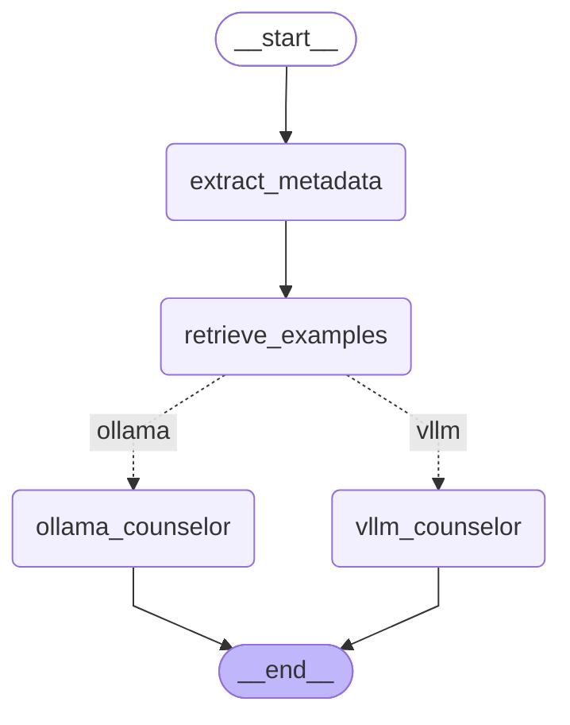

```mermaid
---
config:
  flowchart:
    curve: linear
---
graph TD;
	__start__([<p>__start__</p>]):::first
	extract_metadata(extract_metadata)
	retrieve_examples(retrieve_examples)
	vllm_counselor(vllm_counselor)
	ollama_counselor(ollama_counselor)
	__end__([<p>__end__</p>]):::last
	__start__ --> extract_metadata;
	extract_metadata --> retrieve_examples;
	retrieve_examples -. &nbsp;ollama&nbsp; .-> ollama_counselor;
	retrieve_examples -. &nbsp;vllm&nbsp; .-> vllm_counselor;
	ollama_counselor --> __end__;
	vllm_counselor --> __end__;
	classDef default fill:#f2f0ff,line-height:1.2
	classDef first fill-opacity:0
	classDef last fill:#bfb6fc

```