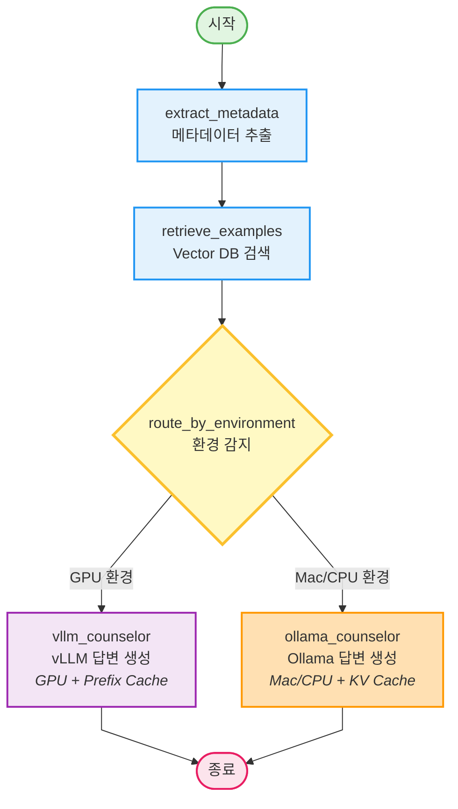

# LangGraph 구조 (환경별 라우팅)

## 노드 설명

1. **extract_metadata**: 사용자 쿼리에서 도메인과 대화 턴 수 추출
2. **retrieve_examples**: Pinecone/ChromaDB에서 유사한 상담 예시 검색 (Few-shot)
3. **route_by_environment**: 환경 감지 후 라우팅
   - GPU 감지 → vllm_counselor로 이동
   - Mac/CPU 감지 → ollama_counselor로 이동
4. **vllm_counselor**: vLLM으로 답변 생성 (Prefix Caching)
5. **ollama_counselor**: Ollama로 답변 생성 (KV Cache)

## 주요 특징

- **조건부 라우팅**: `add_conditional_edges()` 사용
- **환경별 최적화**:
  - GPU: vLLM + Prefix Caching
  - Mac/CPU: Ollama + KV Cache
- **통합 프롬프트**: 두 경로 모두 동일한 `build_qa_prompt()` 사용
